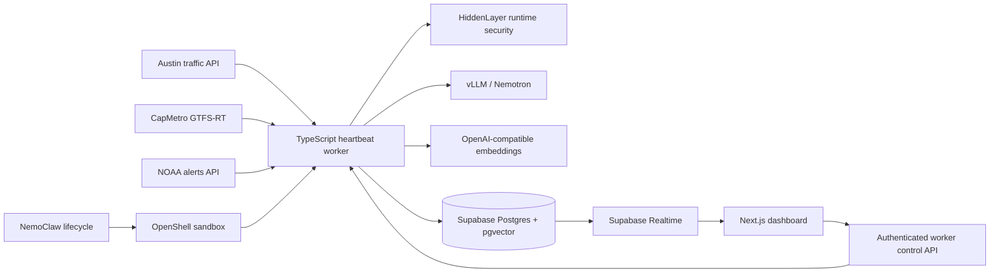
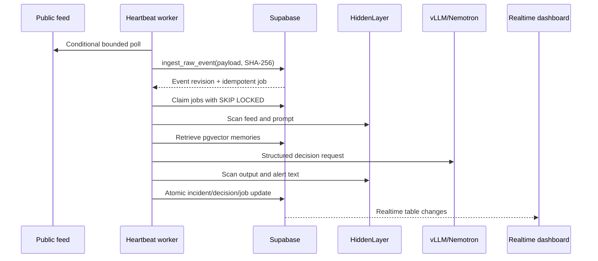

# PulseATX Architecture

## System boundary

Next.js and Vercel are presentation-only. The service-role key, feed polling, job claims, model calls, outcome consolidation, scenario mutation, and persistent heartbeat remain in the worker.

## Event lifecycle

## Reliability and security

- Database uniqueness protects event revisions, jobs, incident memory, outcomes, alerts, and demo runs from duplicate writes.
- The worker claims eight jobs per heartbeat and limits model concurrency to four.
- HTTP clients use timeouts and retries; the control server limits bodies to 16 KiB and enforces request/header timeouts.
- `SIGINT` and `SIGTERM` stop polling, update health, append a timeline event, and close the control server.
- HiddenLayer blocks malicious content; OpenShell enforces deny-by-default network/filesystem policy; operator approval guards high-impact alerts.
